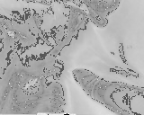

# Photometric Single-view Dense 3D Reconstruction in Endoscopy

Implementation for MICCAI 2022 paper **[Photometric single-view dense 3D reconstruction in endoscopy](https://ieeexplore.ieee.org/document/9981742)** by Víctor M. Batlle, J.M.M. Montiel, and Juan D. Tardós.

**[\[Paper\]](https://ieeexplore.ieee.org/document/9981742) 


## Setup

Make sure Eigen, OpenCV, and Ceres are installed. Add Ceres installation location to environment variable called `CERES_PATH`.

After cloning the repo, run the following:
```
mkdir build
cd build
cmake ../photometric_reconstruction
make
```
Edit the `get_camera_params()` function with your camera's parameters based on the paper.

## Calibration

TODO

## Reconstruction/Visualization

Example images included in `images` directory:
Original: 
Reconstructed: 

## Evaluation

TODO

## 🤝 Contributing

Contributions from the community are welcome! If you have any ideas or suggestions for improving the library, please feel free to: submit a pull request, raise an issue, e.t.c.

## Bibtex

If you find this work helpful, you can cite our paper as follows:

```
@INPROCEEDINGS{
  9981742,
  author={Batlle, Víctor M. and Montiel, J.M.M. and Tardós, Juan D.},
  booktitle={2022 IEEE/RSJ International Conference on Intelligent Robots and Systems (IROS)}, 
  title={Photometric single-view dense 3D reconstruction in endoscopy}, 
  year={2022},
  volume={},
  number={},
  pages={4904-4910},
  doi={10.1109/IROS47612.2022.9981742}
  }

```